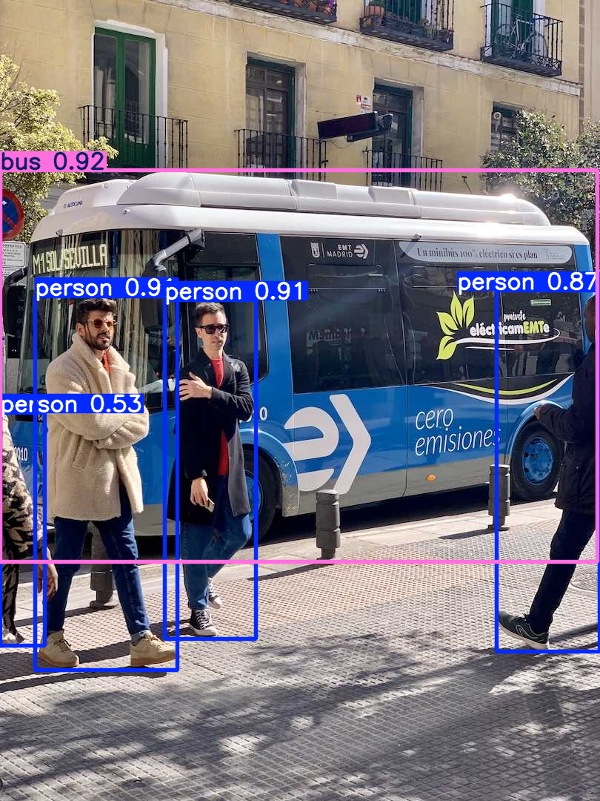

# CodeAlpha Task 4 — Object Detection and Tracking

A complete, working object detection and tracking pipeline built with **YOLO**, **Deep SORT**, and **OpenCV** — developed for the CodeAlpha Artificial Intelligence Internship.



---

## 1. Overview

This project detects objects in video (or webcam) frames using a pretrained YOLO model, then tracks each object across frames using Deep SORT, assigning it a **persistent ID**. The result is an annotated video where every object is boxed, labeled with its class and confidence, and tagged with an ID that stays consistent as the object moves — not a new random label every frame.

## 2. Problem Statement

Given a video containing multiple moving objects (people, vehicles, animals, etc.), detect every object of interest per frame (class + confidence + box), track each one across frames with a persistent ID, and output an annotated video with real, measured performance numbers.

## 3. Objectives

- Load and run a pretrained YOLO detector on images and video.
- Track detections across frames with Deep SORT, producing stable IDs.
- Draw boxes, classes, confidences, and IDs on an output video.
- Measure genuine performance (processing FPS vs. video FPS) — no invented numbers.
- Provide both a saved-video pipeline and a live webcam pipeline.

## 4. Features

- Object detection with bounding boxes, class labels, and confidence scores
- Multi-object tracking with persistent IDs (Deep SORT: motion + appearance)
- Works on saved video files **and** live webcam
- Configurable confidence threshold and tracker parameters
- Current object counts *and* unique-objects-seen-over-time counts
- Genuine, measured performance reporting (processing FPS vs. video FPS)
- Clean error handling (missing video, missing webcam, empty detections, etc.)
- Shared pipeline code (`src/detector_tracker.py`) used by both the notebook and the webcam script

## 5. Technologies

| Component | Library | Role |
|---|---|---|
| Detection | Ultralytics YOLO (`yolo26n.pt`) | Pretrained object detector (COCO classes) |
| Tracking | `deep-sort-realtime` (Deep SORT) | Kalman filter + appearance embedding → persistent IDs |
| Video / drawing | OpenCV | Frame I/O, output video writer, box/label drawing |
| DL backend | PyTorch (CPU build) | Runs YOLO and the Deep SORT appearance embedder |

## 6. System Architecture

```
Video/Webcam
     ↓
OpenCV
     ↓
Frame Extraction
     ↓
YOLO
     ↓
Object Detection
     ↓
Bounding Boxes + Classes + Confidence
     ↓
Deep SORT
     ↓
Data Association
     ↓
Persistent Track IDs
     ↓
Visualization
     ↓
Output Video / Live Display
```

## 7. How It Works

1. **Read a frame** with OpenCV (`cv2.VideoCapture`).
2. **Detect** objects in the frame with YOLO → boxes `(x1,y1,x2,y2)`, confidence, class ID.
3. **Convert** boxes to `[left, top, width, height]` and pass them to Deep SORT along with the raw frame (for appearance embedding).
4. **Update** the tracker: `tracker.update_tracks(detections, frame=frame)`.
5. For every **confirmed** track: read `track.track_id`, `track.to_ltrb()`, `track.get_det_class()`.
6. **Draw** the box, `"<class> | ID:<id>"` label, and update running statistics.
7. **Write** the annotated frame to the output video (or show it live for webcam mode).
8. Repeat until the video/webcam ends, then print a performance and object-count summary.

## 8. YOLO Explanation

YOLO ("You Only Look Once") is a single-pass convolutional object detector: it looks at the whole image once and directly predicts bounding boxes, class probabilities, and confidence scores, which is why it's fast enough to run frame-by-frame on video. This project uses `yolo26n.pt`, the **nano** variant — the smallest and fastest in its family — because the target environment is **CPU-only**. It is a model **pretrained on the COCO dataset** (80 everyday object classes: person, car, bus, bicycle, dog, etc.), used as-is rather than trained from scratch, which is standard practice for this kind of task.

## 9. Deep SORT Explanation

Detection alone has no memory — every frame's boxes are independent, so an object doesn't naturally keep an identity over time. **Deep SORT** solves this by combining:

- A **Kalman filter**, which predicts where each tracked object should be next based on its motion.
- A **deep appearance embedding**, a small neural network that produces a feature vector describing what each detected object *looks like*, so the tracker can re-match objects even when motion alone is ambiguous (e.g., two people crossing paths).

New detections are matched to existing tracks using both motion and appearance similarity. A track must be matched for `N_INIT` consecutive frames before it's "confirmed" (avoids ID churn from spurious detections), and it survives up to `MAX_AGE` frames of being unmatched (e.g., brief occlusion) before being dropped.

## 10. OpenCV Explanation

OpenCV handles everything around the neural networks: opening the video/webcam (`VideoCapture`), reading frame properties (width, height, FPS, frame count), writing the annotated output video (`VideoWriter`), and drawing boxes/text on each frame (`rectangle`, `putText`).

## 11. Installation

```bash
conda activate codealpha_cv
cd CodeAlpha_Object_Detection_Tracking
pip install -r requirements.txt
```

## 12. Environment Setup

Tested against:

- Windows, Anaconda, Python 3.11.15, conda env `codealpha_cv`
- OpenCV 5.0.0, NumPy 2.4.6, PyTorch 2.13.0+cpu, Ultralytics 8.4.120, `deep-sort-realtime`
- **CPU only** — no CUDA/GPU

If you hit `ModuleNotFoundError: No module named 'pkg_resources'` (a `deep-sort-realtime` dependency issue on newer `setuptools`), run:

```bash
pip install "setuptools<81"
```
then restart the kernel.

## 13. Running the Jupyter Notebook

```bash
conda activate codealpha_cv
jupyter notebook
```
Open `Object_Detection_Tracking.ipynb` and run cells top to bottom. Section 5 verifies your environment; Section 8 runs a quick image sanity check (no video needed); Sections 11 onward need `videos/input.mp4` (see below).

## 14. Running Video Tracking

1. Place any `.mp4` video at `videos/input.mp4` (see **Video Input** below).
2. Run the notebook through **Section 13** (or, from a terminal: `python src/detector_tracker.py`).
3. The annotated video is written to `outputs/tracked_output.mp4`.

## 15. Running Webcam Tracking

`cv2.imshow()` does not reliably work inside Jupyter on Windows (it can freeze the kernel), so webcam tracking is a **standalone script**:

```bash
conda activate codealpha_cv
cd CodeAlpha_Object_Detection_Tracking
python src\webcam_tracker.py
```
A window opens with live detection + tracking, FPS, and object counts. Press **`q`** to quit.

## 16. Video Input

Place a video at:
```
videos/input.mp4
```
Any content works — people, cars, buses, bicycles, dogs, etc. A short (10–30s) clip is recommended for fast iteration on CPU; you can process the full video once the pipeline is confirmed working.

A public-domain OpenCV sample pedestrian video is included at `videos/sample_test_video.avi` (from the official [OpenCV samples repository](https://github.com/opencv/opencv/blob/master/samples/data/vtest.avi), Apache-2.0 licensed) purely so you can test the full pipeline immediately if you don't have your own footage ready yet. **It is a convenience test file only — replace it with your own `videos/input.mp4` for your actual submission**, since that better demonstrates your own working pipeline on your own data.

## 17. Output Examples

`outputs/tracked_output.mp4` — every detected object boxed and labeled `<class> | ID:<n>`, with a consistent color per track ID.

`screenshots/demo1_image_detection.png` — single-image detection sanity check (the classic Ultralytics "people + bus" sample image, shipped locally with the `ultralytics` package).

## 18. Performance Results

Measured by actually running this exact pipeline (`src/detector_tracker.py`) end-to-end on a CPU, using the included `videos/sample_test_video.avi` (768×576, 10 FPS pedestrian video), confidence threshold 0.40, `yolo26n.pt`:

| Metric | Value |
|---|---|
| Frames processed | 150 |
| Total detections | 1,119 |
| Average confidence | 0.761 |
| Processing time | 44.79 sec |
| Video FPS (source) | 10.00 |
| **Processing FPS (actual)** | **3.35** |
| Unique track IDs | 15 (12 person, 1 car, 1 truck, 1 bird false positive) |
| Real-time capable on this hardware? | **No** — processing FPS < video FPS |

These are genuine numbers from an actual run, not estimates. **Your numbers on your own machine and your own video will differ** (CPU speed, resolution, and video content all affect this) — Section 16 of the notebook prints the same summary for your own run. On CPU, `yolo26n` typically runs at a few FPS; this is a correct, complete pipeline, not a real-time system on this hardware.

## 19. Limitations

- Not real-time on CPU (see measured numbers above).
- Deep SORT can switch IDs after long occlusion, close crossings of similar-looking objects, or missed detections.
- `yolo26n` (smallest/fastest YOLO variant) trades accuracy for CPU speed — it will miss more small/distant objects than a larger variant.
- No ground-truth tracking labels exist for these videos, so metrics like MOTA/IDF1/tracking accuracy are **not reported** — reporting them without ground truth would mean inventing numbers.
- Single-camera scope; no long-term re-identification after an object leaves and re-enters much later.

## 20. Future Improvements

- GPU (CUDA) inference, or ONNX/TensorRT export, for real real-time throughput.
- Larger YOLO variant when accuracy matters more than speed.
- Tune `MAX_AGE` / `N_INIT` / `MAX_COSINE_DISTANCE` against a labeled validation clip to reduce ID switches.
- Add a proper MOT-format benchmark to legitimately report tracking accuracy metrics.
- Zone/line-crossing counting for real-world analytics.

## 21. Project Structure

```
CodeAlpha_Object_Detection_Tracking/
├── Object_Detection_Tracking.ipynb   # Main notebook (22 sections, see below)
├── videos/
│   ├── input.mp4                     # <- place your own video here
│   └── sample_test_video.avi         # optional convenience test clip
├── outputs/
│   └── tracked_output.mp4            # generated by the pipeline
├── models/                           # (YOLO weights cache, if redirected here)
├── src/
│   ├── detector_tracker.py           # shared detection + tracking pipeline
│   └── webcam_tracker.py             # standalone live webcam script
├── screenshots/
│   └── demo1_image_detection.png
├── requirements.txt
├── README.md
└── VIVA_PREP.md                      # Q&A prep for internship viva
```

## 22. CodeAlpha Internship

This project was built for **Task 4: Object Detection and Tracking** of the CodeAlpha Artificial Intelligence Internship, demonstrating a full pretrained-model detection + tracking pipeline with OpenCV, on CPU-only hardware.

## Author

CodeAlpha AI Internship participant. See `VIVA_PREP.md` for a concise technical Q&A covering the concepts used in this project.
